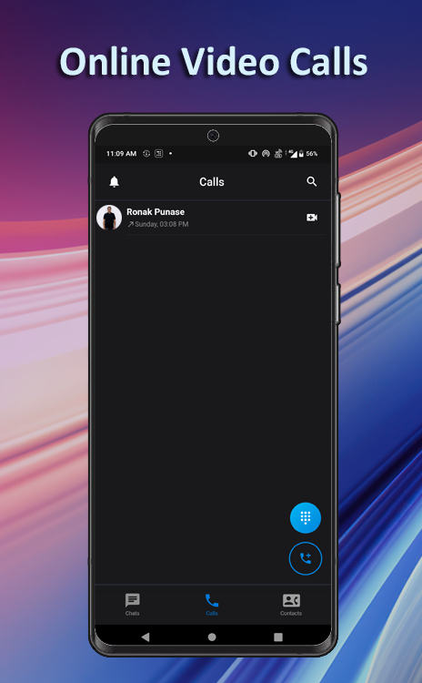
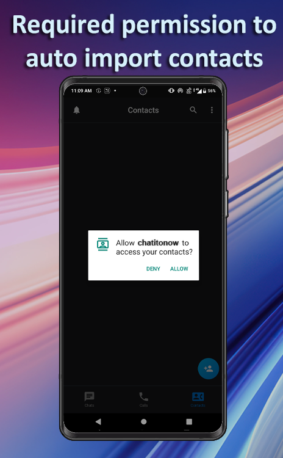
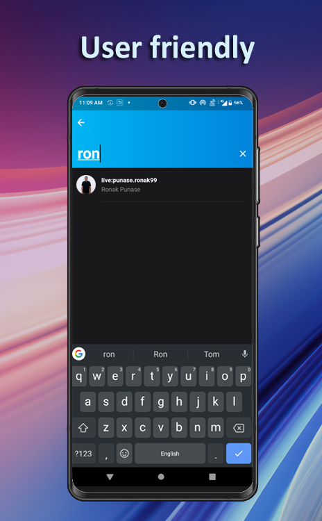
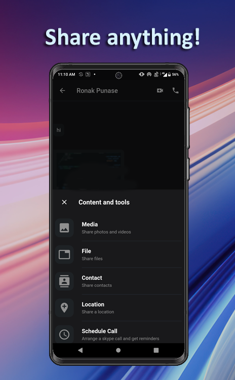

# Firebase Firestore chat application with Email/Password Authentication

A reactive chat application.

# Features
Our project aims to develop a versatile and user-friendly video call chat application that empowers users with seamless communication capabilities. This innovative platform will enable users to connect with their contacts through high-quality video calls, send text messages, import and manage their contacts, and effortlessly share various types of files with their peers.

• Cloud Firestore is a good solution for low-latency database storage.
• Firebase provides authentication and security through Rules.
• Creating data access object (DAO) files helps to put Firebase functionalities in one place

# How did we create this application?
We chose to use Flutter and BLoC (Business Logic Component) for our video call chat application due to their unique strengths in handling streams and concurrency, which are crucial aspects of building a real-time communication platform.

Here we reactively displaying messages and testing messaging capability with authentication in Firebase.
<p float="left">
  
  
</p>

For data security we add these rules to firebase firestore rules :
```
rules_version = '2';
service cloud.firestore {
 match /databases/{database}/documents {
 match /{document=**} {
 allow read, write: if request.auth != null; 
  }
 }
}
```

<p float="left">
  
  
   
</p>

## Why we chose BLoC ?
BLoC is a state management pattern that pairs well with Flutter. It enables us to efficiently manage the application's complex state, especially when dealing with real-time communication elements like video calls and chat messages. BLoC provides a clear separation between the presentation layer and business logic, making our codebase more maintainable and testable.

## Concurrency
<p float="left">
   
   
</p>
Streams for Real-Time Updates: Flutter integrates seamlessly with Dart's native support for streams. Streams are perfect for handling real-time data and events, such as incoming chat messages and video call updates. With streams, we can push updates to the user interface as soon as they are available, ensuring a responsive and dynamic user experience.

Concurrency for Performance: Concurrency is vital for managing multiple tasks concurrently, which is essential in a communication app. For instance, while a user is on a video call, they may also want to send text messages or share files. Concurrency mechanisms provided by Dart and the BLoC pattern allow us to handle these parallel tasks efficiently, ensuring smooth performance without freezing the app or causing delays in video calls.

In summary, by using Flutter and BLoC with their stream and concurrency capabilities, we are equipped to build a high-performance, cross-platform video call chat application that can handle real-time communication effectively while providing a consistent and user-friendly experience across different devices.


